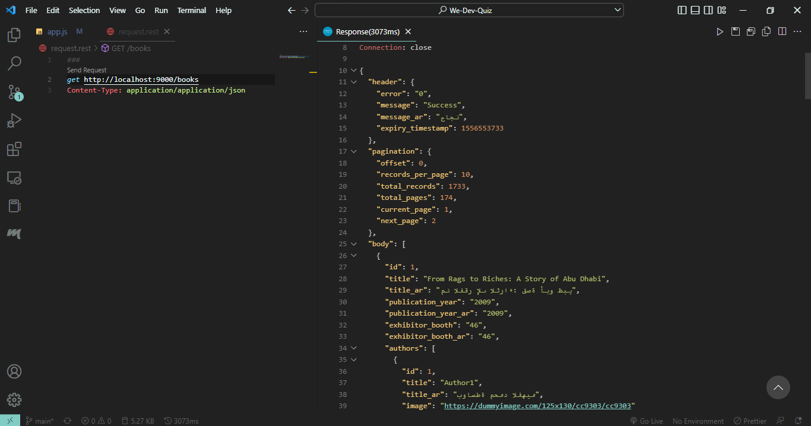
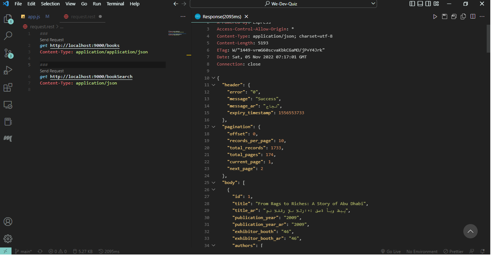

# Required Results

### Task 1

- [click here](https://aabf.docs.apiary.io/#reference/0/books/books)

#### Answer 1

**Code**

```javascript:
app.get("/books", async (req, res) => {
  await axios
    .post("https://private-anon-2689b13390-aabf.apiary-mock.com/books")
    .then((response) => {
      console.log(response.data);
      res.status(200).send(response.data);
    });
});
```

**Screenshot**



### Task 2

- [click here](https://aabf.docs.apiary.io/#reference/0/books-search/books-search)

#### Answer 2

```javascript:
app.get("/bookSearch", async (req, res) => {
  await axios
    .post(`https://private-anon-2689b13390-aabf.apiary-mock.com/books-search`)
    .then((response) => {
      console.log(response.data);
      res.send(response.data);
    });
});

```

**Screenshot**


